<div align="center">


# JbrainTrader

**키움 OpenAPI 연동 · 텍스트 파일 전략 · Claude CLI 기반 AI 운용을 갖춘 개인용 주식 자동매매 시스템**

[](requirements_64.txt)
[](frontend/)
[](trading_app/)
[](core/database.py)
[](#ai-기능)
[](LICENSE)

[**🔗 라이브 데모 보기**](https://jbraintrader-demo.pages.dev) · [**📝 개발 이야기 (티스토리)**](https://javata.tistory.com/116) · [주요 기능](#주요-기능) · [화면 소개](#화면-소개) · [설치](#설치) · [전략 파일](#전략-파일) · [AI 기능](#ai-기능)

<a href="https://jbraintrader-demo.pages.dev">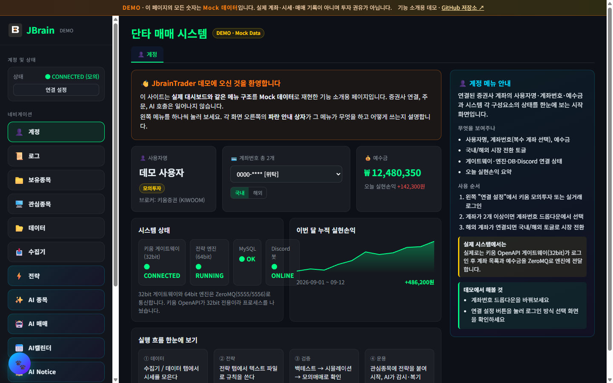</a>

<sub>위 화면은 <a href="https://jbraintrader-demo.pages.dev">데모 사이트</a>를 캡처한 것으로 모든 숫자는 Mock 데이터입니다. 실제 계좌·시세가 아닙니다.</sub>

</div>

키움증권 OpenAPI로 시세·계좌를 연동하고, 파일로 정의한 전략을 백테스트·모의매매·실매매하며, AI(Claude CLI)가 종목 선별·매매 전략·아침 브리핑·매매 복기를 도와줍니다. Vue 웹 대시보드와 Flutter 모바일 앱으로 어디서든 상태를 확인할 수 있습니다.

> ⚠️ 이 프로젝트는 개인 학습·개발 기록입니다. 특정 종목이나 전략의 수익을 보장하지 않으며, 실계좌 매매로 발생하는 손실은 사용자 본인의 책임입니다. 반드시 모의투자로 충분히 검증한 뒤 사용하세요.

---

## 주요 기능

| 영역 | 내용 |
|------|------|
| 시세·계좌 연동 | 키움 OpenAPI 실시간 시세, 복수 계좌 선택, 보유종목, 체결내역, 일별 실현손익 (국내 + 해외) |
| 전략 엔진 | 텍스트 파일(`strategy/*.txt`)로 전략 정의 → 백테스트 → 모의매매 → 일일 리포트 |
| 듀얼 ETF 전략 | 정방향/인버스 ETF 페어의 스프레드 Z-Score 기반 분할매수·익절·강제청산 |
| 브로커 확장 | 한국투자증권(KIS) REST, 바이낸스(현물/선물) 연동 |
| 데이터 수집 | Yahoo Finance / KRX 일봉·분봉 수집, 틱 데이터 생성 및 시뮬레이션 |
| AI 운용 | AI 종목 선별, AI 매매 전략(목표가/손절가), 아침 브리핑, 주간 매매 복기, 전략 이탈 감시, 전략 스코어카드 |
| 매매일지 | 달력형 매매일지, 구글 시트 자동 업로드(월별 탭 + 일별 요약) |
| 알림 | Discord 봇으로 로그·포트폴리오·전략 이탈 알림 |
| 모바일 | Flutter 앱(Android/Web/Windows)에서 대시보드·매매일지·AI 탭·계좌 전환 |
| 개발 편의 | Claude CLI 훅으로 개발 작업 기록을 대시보드 "CLI 작업" 탭에 자동 저장 |

---

## 화면 소개

대시보드의 주요 메뉴입니다. 모든 화면은 [데모 사이트](https://jbraintrader-demo.pages.dev)에서 직접 눌러 볼 수 있으며, 각 화면 오른쪽 안내 상자가 메뉴의 용도와 사용 순서를 설명합니다.

<table>
  <tr>
    <td width="50%" align="center">
      <a href="https://jbraintrader-demo.pages.dev/#/MONITORING">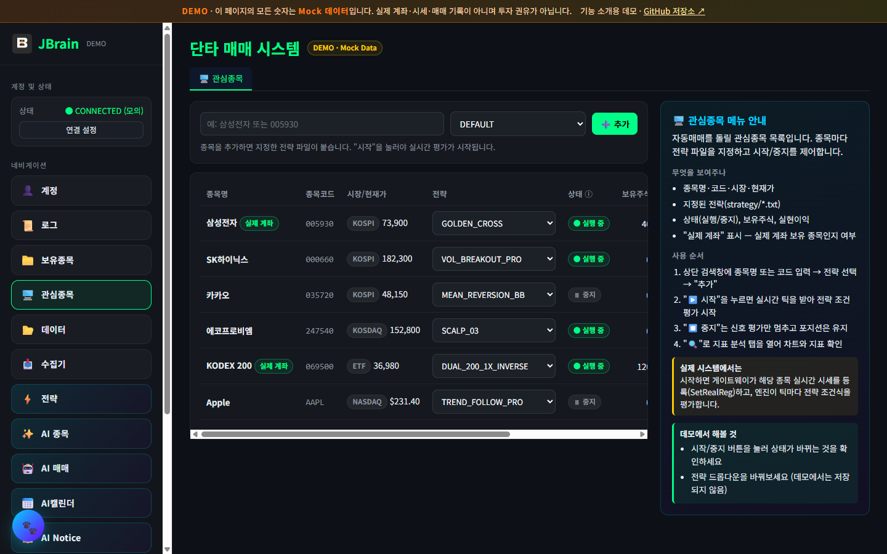</a><br/>
      <b>🖥️ 관심종목</b><br/>
      <sub>종목마다 전략 파일을 지정하고 시작/중지로 자동매매를 제어</sub>
    </td>
    <td width="50%" align="center">
      <a href="https://jbraintrader-demo.pages.dev/#/STRATEGY">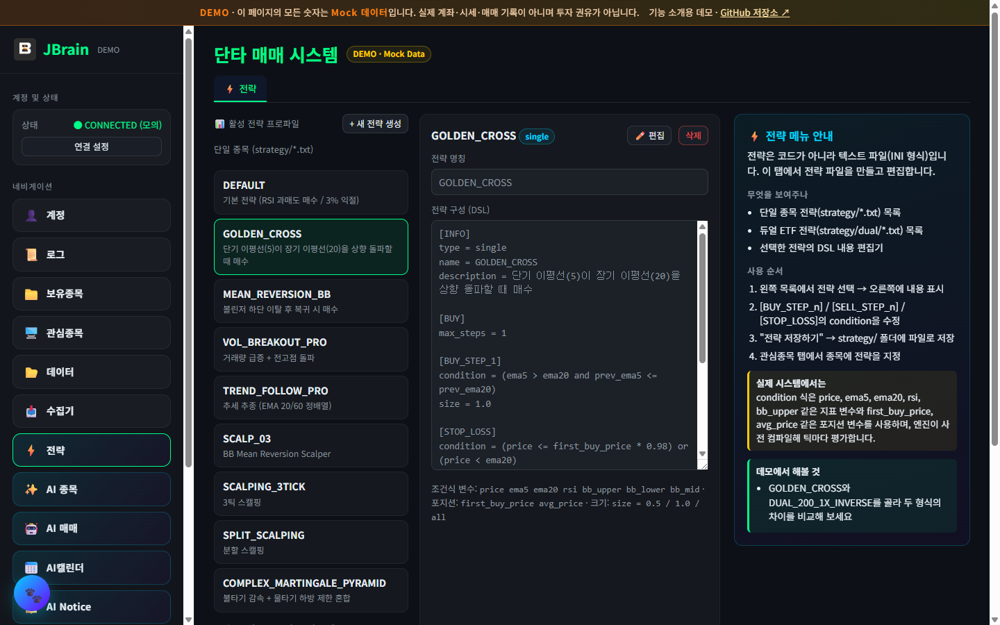</a><br/>
      <b>⚡ 전략</b><br/>
      <sub>코드가 아닌 INI 텍스트 파일로 매수·매도·손절 조건을 정의</sub>
    </td>
  </tr>
  <tr>
    <td width="50%" align="center">
      <a href="https://jbraintrader-demo.pages.dev/#/AITRADES">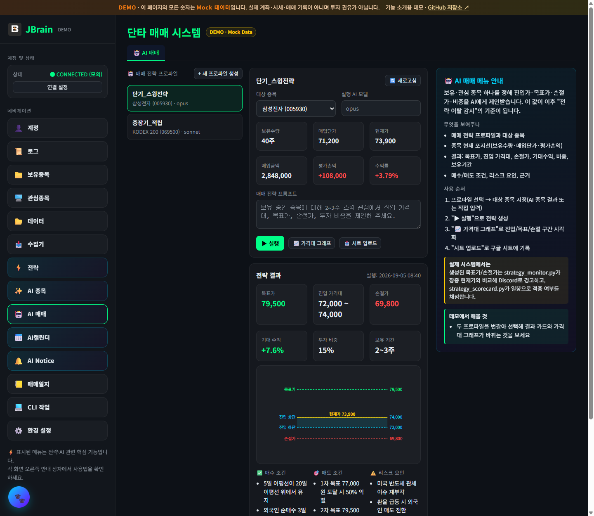</a><br/>
      <b>🤖 AI 매매</b><br/>
      <sub>Claude CLI가 목표가·손절가·비중을 제안하고, 장중 이탈 감시의 기준으로 사용</sub>
    </td>
    <td width="50%" align="center">
      <a href="https://jbraintrader-demo.pages.dev/#/JOURNAL">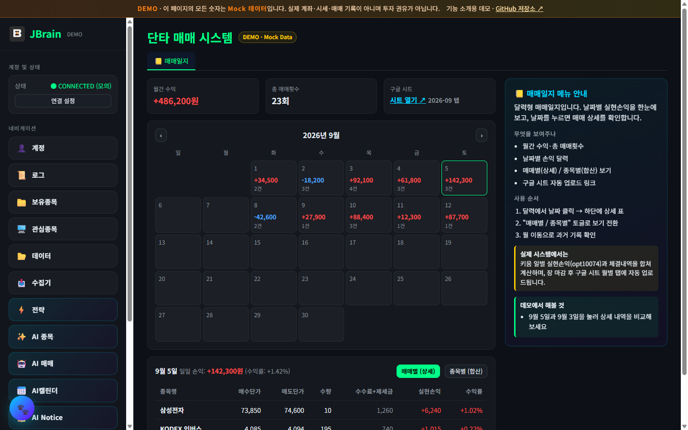</a><br/>
      <b>📒 매매일지</b><br/>
      <sub>달력형 일별 실현손익과 매매 상세, 구글 시트 자동 업로드</sub>
    </td>
  </tr>
  <tr>
    <td colspan="2" align="center">
      <a href="https://jbraintrader-demo.pages.dev/#/LOG">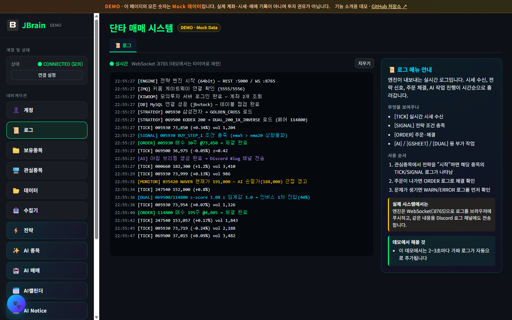</a><br/>
      <b>📜 실시간 로그</b><br/>
      <sub>시세 수신 → 전략 신호 → 주문 체결 → AI 알림이 WebSocket으로 흘러가는 엔진 로그</sub>
    </td>
  </tr>
  <tr>
    <td colspan="2" align="center">
      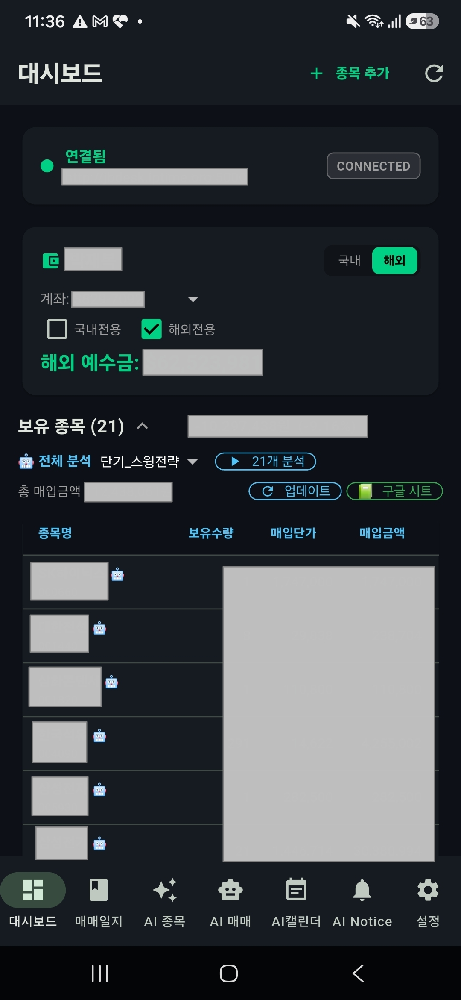
      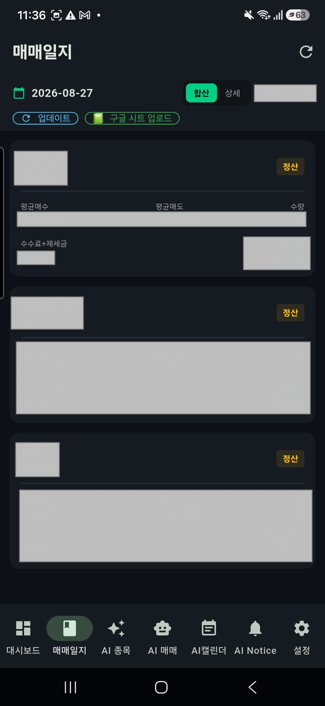
      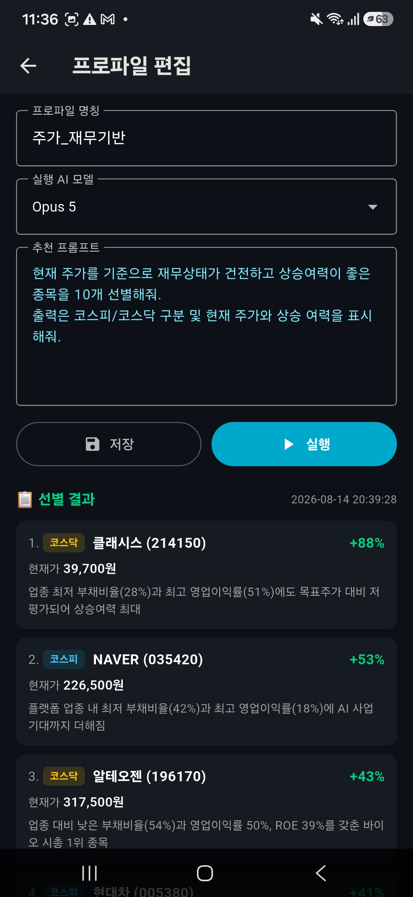
      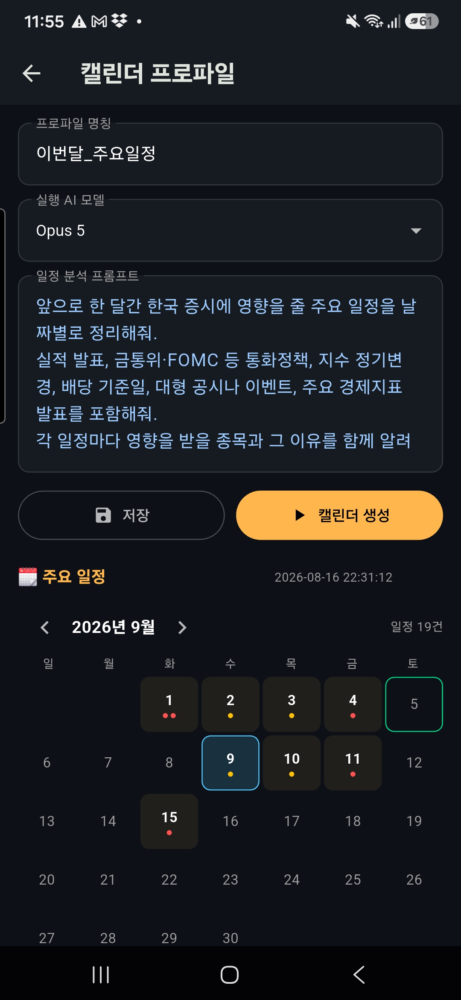
      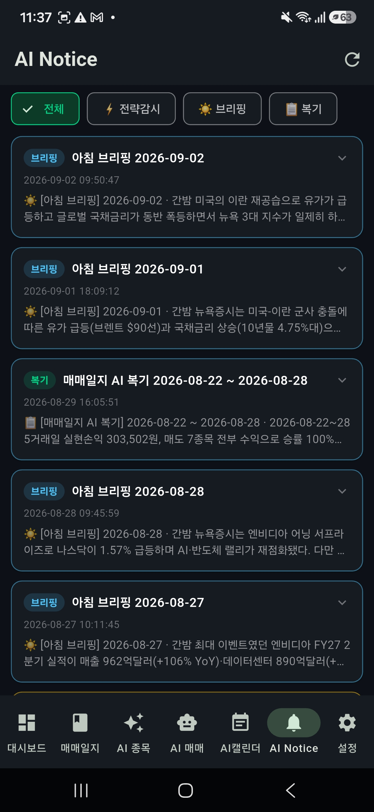<br/>
      <b>📱 Flutter 모바일 앱</b><br/>
      <sub>대시보드 · 매매일지 · AI 종목 · AI 캘린더 · AI Notice — 엔진 서버 주소만 넣으면 같은 데이터를 휴대폰에서 확인 (실제 화면, 계좌·금액 마스킹)</sub>
    </td>
  </tr>
  <tr>
    <td width="50%" align="center">
      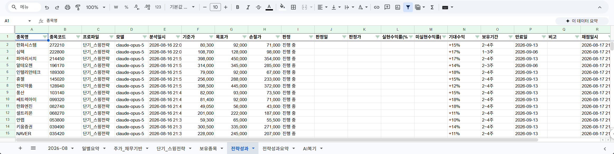<br/>
      <b>📗 구글 시트 — 전략성과</b><br/>
      <sub>AI 매매 전략의 목표가·손절가를 일봉으로 자동 채점한 기록</sub>
    </td>
    <td width="50%" align="center">
      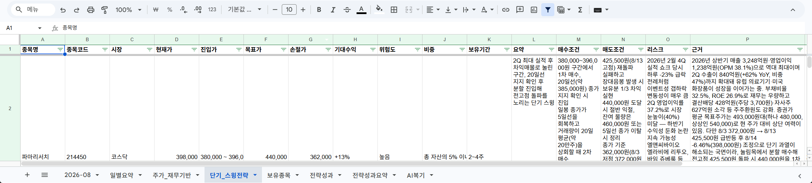<br/>
      <b>📗 구글 시트 — AI 매매 전략</b><br/>
      <sub>프로파일 이름 탭에 진입가·목표가·손절가·매수/매도 조건·리스크·근거가 한 행씩 업로드</sub>
    </td>
  </tr>
  <tr>
    <td width="50%" align="center">
      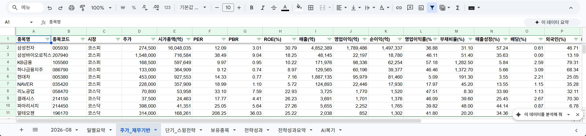<br/>
      <b>📗 구글 시트 — AI 종목 선별</b><br/>
      <sub>선별 근거가 된 PER·PBR·ROE·부채비율 등 재무 지표를 종목별로 저장</sub>
    </td>
    <td width="50%" align="center">
      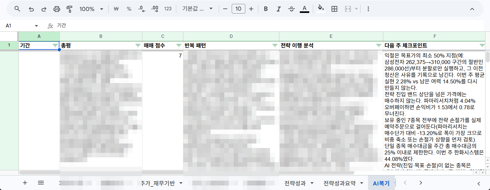<br/>
      <b>📗 구글 시트 — 주간 매매 복기</b><br/>
      <sub>총평·매매 점수·반복 패턴·전략 이행 분석·다음 주 체크포인트 (실제 금액 셀은 모자이크)</sub>
    </td>
  </tr>
</table>

<sub>구글 시트 캡처는 실제 시트에서 브라우저 영역을 잘라낸 것이며, 매매일지 탭은 실제 매매 금액이 포함되어 공개하지 않습니다.</sub>

---

## 시스템 구조

키움 OpenAPI는 **32비트 전용**이라 데이터 분석에 유리한 64비트 파이썬과 한 프로세스에 담을 수 없습니다. 그래서 두 프로세스로 나누고 ZeroMQ로 연결했습니다.

```
┌──────────────────────────────┐      ZeroMQ (5555 / 5556)      ┌────────────────────────────────────┐
│  키움 게이트웨이 (32bit)      │ ◄────────────────────────────► │  전략 엔진 (64bit, Flask)            │
│  kiwoom/api_server.py        │                                │  backend/main.py                   │
│  - OpenAPI 로그인/시세/주문   │                                │  - 전략 실행, 백테스트, 시뮬레이션     │
│  - 자동 로그인(auto_login)   │                                │  - REST :5000 / WebSocket :8765      │
└──────────────────────────────┘                                │  - MySQL(시세·거래) + SQLite(AI·설정) │
                                                                └──────────────────┬─────────────────┘
                                                                                   │
                                            ┌──────────────────────────────────────┼────────────────────┐
                                            ▼                                      ▼                    ▼
                                   Vue 3 웹 대시보드 (:5173)            Flutter 모바일 앱          Discord 봇
                                   frontend/                            trading_app/               discord_bot/
```

---

## 디렉터리 구조

```
.
├── kiwoom/          키움 OpenAPI 게이트웨이 (32bit Python, PyQt5)
├── auto_login/      키움 로그인 창 자동 입력 (암호화된 자격증명 사용)
├── backend/         전략 엔진 + Flask REST/WebSocket 서버, AI 기능 모듈
│   ├── main.py          엔진 진입점
│   ├── ai_*.py          AI 종목/매매/브리핑/복기/캘린더/공지
│   ├── strategy_*.py    전략 이탈 감시, 스코어카드
│   └── simulator/       틱 생성·시뮬레이션
├── core/            공용 라이브러리
│   ├── broker/          kiwoom / kis / binance 브로커 어댑터
│   ├── provider/        yahoo / krx 데이터 제공자
│   ├── strategy/        듀얼 ETF 스프레드 트레이더
│   ├── service/         데이터 수집기, 구글 시트 업로더
│   ├── database.py      MySQL 접근 (테이블 자동 생성)
│   └── strategy_manager.py  전략 파일 파서
├── strategy/        전략 정의 파일 (single: *.txt, dual: dual/*.txt)
├── frontend/        Vue 3 + Vite + ApexCharts 대시보드
├── trading_app/     Flutter 모바일 앱
├── discord_bot/     Discord 봇 (로그 채널, /portfolio 명령)
├── export/          콘솔 단독 실행용 트레이더 (모의/실전)
├── report/          모의매매 일일 리포트 예시
├── docs/            전략 설계 문서 (가이드·소개 글·작업 기록은 로컬 전용으로 커밋 제외)
├── demo/            기능 소개용 정적 데모 사이트 (Mock 데이터, Cloudflare Pages 배포용)
├── backtest.py      백테스트 CLI
├── run.bat / stop.bat / restart.bat   전체 시스템 실행·종료
└── requirements_32.txt / requirements_64.txt
```

---

## 요구 사항

| 항목 | 비고 |
|------|------|
| Windows 10/11 | 키움 OpenAPI가 Windows 전용 |
| 키움증권 OpenAPI+ | 키움 홈페이지에서 설치, 모의투자 신청 권장 |
| Python 3.11 **32bit** | 게이트웨이용 (`C:\Program Files (x86)\Python311-32` 기준) |
| Python 3.10+ **64bit** | 엔진용 (Anaconda 권장) |
| MySQL 8.x | 시세·거래 데이터 저장 |
| Node.js 18+ | Vue 대시보드 |
| Flutter 3.x | 모바일 앱 (선택) |
| Claude CLI | AI 기능 사용 시 (`claude` 명령이 PATH에 있어야 함, 선택) |

---

## 설치

### 1. 저장소 클론

```bash
git clone https://github.com/jbpark/JbrainTrader.git
cd JbrainTrader
```

### 2. 파이썬 패키지

```bash
# 32bit (키움 게이트웨이)
"C:\Program Files (x86)\Python311-32\python.exe" -m pip install -r requirements_32.txt

# 64bit (전략 엔진)
python -m pip install -r requirements_64.txt

# 구글 시트 업로드를 쓰려면 추가
python -m pip install gspread google-auth
```

### 3. 프론트엔드

```bash
cd frontend
npm install
```

### 4. MySQL 데이터베이스

```sql
CREATE DATABASE jbstock DEFAULT CHARACTER SET utf8mb4;
CREATE USER 'jbuser'@'localhost' IDENTIFIED BY '<비밀번호>';
GRANT ALL PRIVILEGES ON jbstock.* TO 'jbuser'@'localhost';
```

테이블은 엔진이 처음 실행될 때 자동으로 생성됩니다.

### 5. 환경 변수 (`.env`)

프로젝트 루트의 [.env.example](.env.example)을 `.env`로 복사한 뒤 값을 채웁니다. **`.env`는 절대 커밋하지 마세요** (`.gitignore`에 포함되어 있습니다).

```bat
copy .env.example .env
```

주요 항목은 다음과 같습니다. 전체 목록과 각 항목 설명은 `.env.example`에 있습니다.

```dotenv
# ── MySQL ──
DB_HOST=localhost
DB_PORT=3306
DB_USER=jbuser
DB_PASSWORD=<비밀번호>
DB_NAME=jbstock

# ── 키움 (자동 로그인, 아래 6번 절차로 암호화된 값을 넣음) ──
KIWOOM_USER_ID=<암호화된 값>
KIWOOM_USER_PW=<암호화된 값>
KIWOOM_CERT_PW=<암호화된 값>
KIWOOM_IS_MOCK=1            # 1: 모의투자, 0: 실거래

# ── 한국투자증권 (선택) ──
KIS_REAL_APP_KEY=
KIS_REAL_APP_SECRET=
KIS_MOCK_APP_KEY=
KIS_MOCK_APP_SECRET=
KIS_ACC_NO=                 # 12345678-01 형식

# ── 바이낸스 (선택) ──
BINANCE_API_KEY=
BINANCE_API_SECRET=

# ── Discord 봇 (선택) ──
DISCORD_BOT_TOKEN=
DISCORD_GUILD_ID=
DISCORD_LOG_CHANNEL_ID=
DISCORD_CMD_CHANNEL_ID=

# ── 구글 시트 매매일지 (선택) ──
GSHEET_CREDENTIALS_PATH=secret/gsheet_service_account.json
GSHEET_SPREADSHEET_ID=
GSHEET_SPREADSHEET_ID_OVERSEAS=

# ── 기타 ──
JBRAIN_DEBUG=0
JBRAIN_AUTO_RECONNECT=1     # 재시작 시 마지막 연결 정보로 자동 재연결
```

키움 API 키, Discord 토큰, 바이낸스 키 등은 웹 대시보드의 **환경설정** 탭에서도 입력할 수 있으며, `secret.key`로 암호화되어 `backend/settings/account_config.json`에 저장됩니다.

### 6. 키움 자동 로그인 자격증명 암호화

로그인 정보는 평문으로 저장하지 않고 Fernet 키(`secret.key`)로 암호화합니다.

```bash
python auto_login/encrypt_utils.py
```

프롬프트에 아이디·비밀번호·인증서 비밀번호를 입력하면 암호화된 문자열이 출력됩니다. 이를 `.env`의 `KIWOOM_*` 항목에 넣으세요. `secret.key`도 커밋 대상이 아닙니다.

---

## 실행

### 한 번에 실행

```bat
run.bat
```

32bit 게이트웨이(관리자 권한 UAC 승인 필요), 64bit 엔진, Vue 개발 서버가 각각 콘솔 창으로 뜹니다. 종료는 `stop.bat`, 재시작은 `restart.bat` 입니다.

> 게이트웨이가 관리자 권한을 요구하는 이유: 키움 로그인 창에 자동으로 값을 입력하려면 Windows UIPI 제한을 넘어야 합니다.

### 개별 실행

```bat
:: 키움 게이트웨이 (32bit)
run_kiwoom_admin.bat

:: 전략 엔진 (64bit)
python -m backend.main

:: 웹 대시보드
cd frontend && npm run dev
```

### 접속 주소

| 서비스 | 주소 |
|--------|------|
| 웹 대시보드 | http://localhost:5173 |
| 엔진 REST API | http://localhost:5000 |
| 엔진 WebSocket | ws://localhost:8765 |

대시보드에서 **연결 설정 → 키움 로그인**을 누르면 게이트웨이가 자동 로그인을 시작합니다.

---

## 전략 파일

전략은 `strategy/` 폴더의 텍스트 파일로 정의하며, 대시보드 **전략** 탭에서 편집할 수도 있습니다.

### 단일 종목 전략 (`strategy/*.txt`)

```ini
[INFO]
type = single
name = GOLDEN_CROSS
description = 단기 이평선(5)이 장기 이평선(20)을 상향 돌파할 때 매수

[BUY]
max_steps = 1

[BUY_STEP_1]
condition = (ema5 > ema20 and prev_ema5 <= prev_ema20)
size = 1.0

[STOP_LOSS]
condition = (price <= first_buy_price * 0.98) or (price < ema20)

[SELL]
max_steps = 2

[SELL_STEP_1]
condition = price >= first_buy_price * 1.03
size = 0.5

[SELL_STEP_2]
condition = ema5 < ema20
size = all
```

조건식에서는 `price`, `ema5`, `ema20`, `rsi`, `bb_upper` 등 `core/indicators.py`가 계산하는 지표와 `first_buy_price`, `avg_price` 같은 포지션 변수를 사용할 수 있습니다.

### 듀얼 ETF 전략 (`strategy/dual/*.txt`)

```ini
[설정]
type = dual
임계값 = 1.0
분할매수 = 40%, 30%, 30%
목표수익 = +0.2%
손절기준 = -1.5%
강제청산 = 15:20
매수금액 = 2,000,000
최대거래 = 일 5회
윈도우 = 30
익절Z = 0.0
시작시간 = 09:20
```

정방향/인버스 ETF 페어(예: KODEX 200 ↔ KODEX 인버스, QQQ ↔ SQQQ)의 스프레드 Z-Score가 임계값을 넘으면 분할 진입하고, 목표수익·손절·강제청산 시각에 정리합니다.

---

## 백테스트 / 콘솔 트레이더

```bash
# 백테스트
python backtest.py --ticker 005930 --strategy GOLDEN_CROSS --start 2026-01-01 --end 2026-06-30
python backtest.py --ticker 069500 --strategy DUAL_200_1X_INVERSE --threshold 1.2 -v
```

```bat
:: 대시보드 없이 콘솔에서만 돌리는 모의/실전 트레이더
export\run_mo.bat                       :: KODEX 200 / 인버스 모의매매
python export\han_qqq_sqqq_real.py      :: 한국투자증권 실계좌 QQQ/SQQQ (주의!)
```

모의매매 결과는 `report/` 에 일자별 마크다운 리포트로 남습니다.

---

## AI 기능

AI 기능은 로컬에 설치된 **Claude CLI**(`claude -p`)를 호출합니다. 별도 API 키 설정은 필요 없고, `claude` 명령이 PATH에 있고 로그인되어 있으면 됩니다. 사용할 모델은 대시보드에서 선택합니다 (기본값 Opus 5).

| 기능 | 설명 |
|------|------|
| AI 종목 | 프로파일(프롬프트)별로 종목을 선별하고 근거를 기록 |
| AI 매매 | 보유·관심 종목의 진입가/목표가/손절가/비중 전략 생성 |
| AI 캘린더 | 실적 발표·경제 일정 등 이벤트 정리 |
| AI Notice | 종목 관련 공지·뉴스 요약 |
| 아침 브리핑 | 장 시작 전 시장 요약을 Discord로 전송 |
| 매매 복기 | 주 1회 최근 매매 내역을 분석해 습관·패턴 리포트 (Discord + 구글 시트) |
| 전략 이탈 감시 | 장중 보유 종목의 현재가를 AI 전략의 손절가/목표가와 비교해 알림 |
| 스코어카드 | AI 매매 전략이 실제로 목표가/손절가에 도달했는지 일봉으로 자동 채점 |

---

## 부가 설정 가이드

- 구글 시트 매매일지: Google Cloud에서 서비스 계정을 만들어 JSON 키를 `secret/gsheet_service_account.json`에 두고, 대상 스프레드시트를 서비스 계정 이메일과 편집자로 공유한 뒤 `.env`의 `GSHEET_SPREADSHEET_ID`에 시트 ID를 넣습니다. 매매일지 탭의 "시트 업로드" 버튼으로 동작을 확인할 수 있습니다.
- Discord 봇: [discord_bot/.env.example](discord_bot/.env.example) 을 `discord_bot/.env` 로 복사해 값을 채운 뒤 `discord_bot/run_bot.bat`
- Flutter 앱: `trading_app/` 에서 `flutter run`. 앱 설정 화면에서 엔진 서버 주소(IP:5000)를 입력합니다. APK 빌드는 `build_apk.bat`
- Claude CLI 작업 기록 훅: [.claude/settings.json](.claude/settings.json)에 등록된 `UserPromptSubmit` / `Stop` 훅이 [cli_hook_prompt.py](cli_hook_prompt.py) 와 [cli_hook_stop.py](cli_hook_stop.py) 를 실행해 프롬프트와 결과 요약을 엔진(`JBRAIN_BASE_URL`, 기본 http://localhost:5000)으로 보내고, 대시보드 "CLI 작업" 탭에 저장합니다. 엔진이 꺼져 있으면 훅은 조용히 건너뜁니다.
- 기능 데모 페이지: [demo/](demo/) 폴더의 정적 사이트가 Cloudflare Pages에 배포되어 있습니다 → https://jbraintrader-demo.pages.dev . 재배포 방법은 [demo/README.md](demo/README.md) 참고.
- 개발 이야기 (블로그): 이 프로젝트를 만들게 된 계기와 구조, 전략·AI·일상 편의 기능을 시리즈로 정리한 글입니다 → https://javata.tistory.com/116

---

## 보안 주의사항

다음 파일은 `.gitignore`에 등록되어 있으며 **절대 공개 저장소에 올리지 마세요.**

- `.env`, `discord_bot/.env` — 계정·API 키
- `secret.key`, `secret/` — 암호화 키, 구글 서비스 계정 JSON
- `backend/settings/` — 암호화된 계좌 설정과 SQLite DB
- `*.log`, `*.db`, `*.parquet`, `stock*.xlsx` — 로그와 로컬 데이터

실계좌로 전환하기 전에는 `KIWOOM_IS_MOCK=1`(모의투자)로 충분히 검증하세요.

---

## 라이선스

[MIT License](LICENSE)

이 소프트웨어는 어떠한 보증도 없이 "있는 그대로" 제공됩니다. 실계좌 매매에 사용하여 발생하는 손실에 대해 저작자는 책임지지 않습니다.
